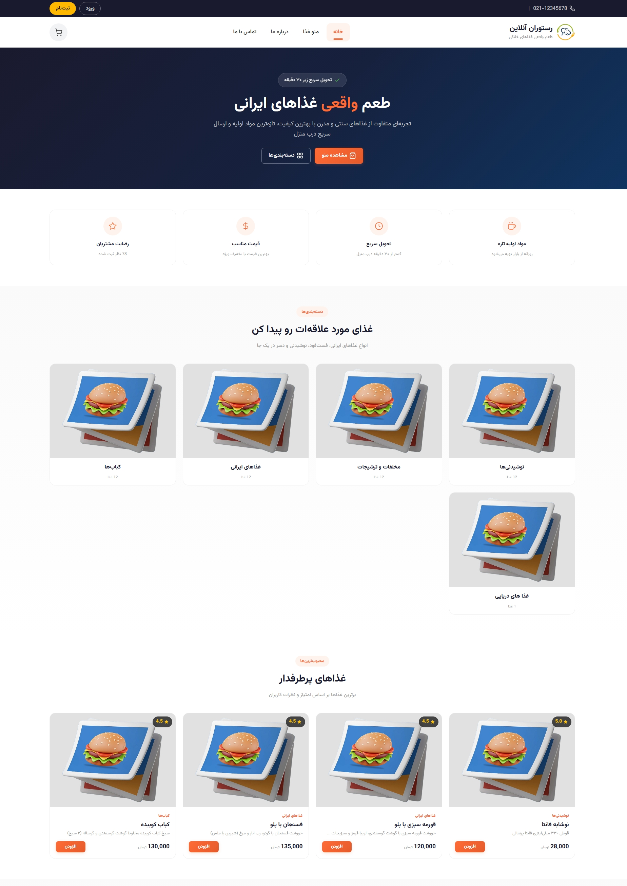
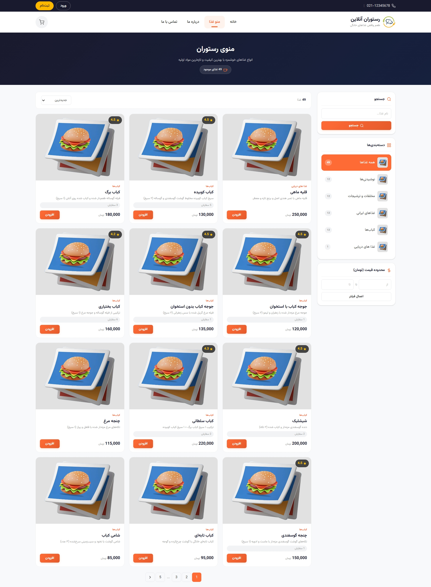
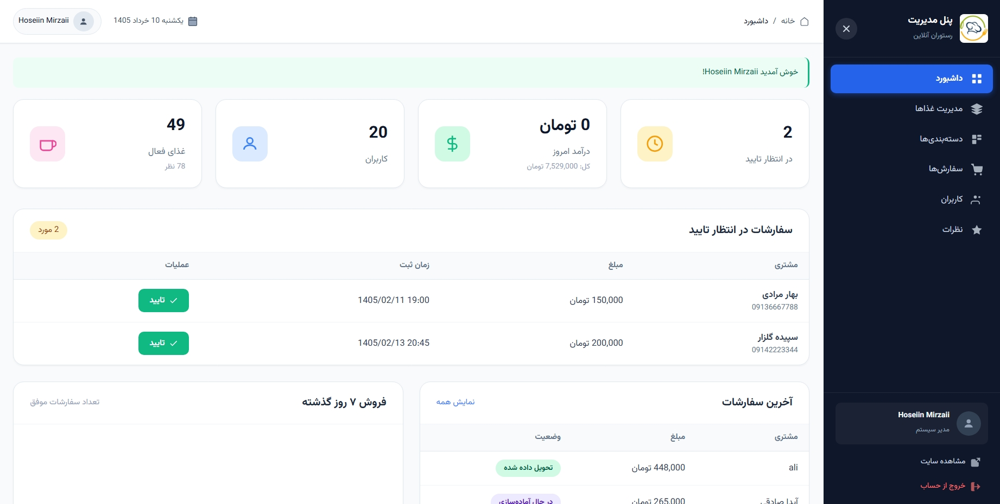

# 🍕 پروژه رستوران آنلاین (سفارش غذا)

یه پروژه کامل و آماده برای دانشجوهای کامپیوتر. سایت سفارش غذای آنلاین با پنل مدیریت و کاربر. با PHP خام نوشته شده و کدنویسی تمیز داره.

---

## 🖼️ پیش‌نمایش پروژه

---

## ✨ امکانات کامل پروژه

### 🍽️ بخش اصلی سایت (کاربر عادی)
- صفحه اصلی جذاب با اسلایدر
- منوی غذاها با دسته‌بندی (پیتزا، برگر، نوشیدنی و...)
- صفحه جزئیات هر غذا با عکس و قیمت
- سبد خرید
- ثبت‌نام و ورود کاربر
- ثبت سفارش و پیگیری وضعیت سفارش
- بخش درباره ما
- کاملاً واکنش‌گرا (موبایل و تبلت)

### 🔐 پنل مدیریت (ادمین)
- داشبورد با آمار فروش و سفارش‌ها
- مدیریت کامل غذاها (افزودن، ویرایش، حذف)
- مدیریت دسته‌بندی‌ها
- مشاهده و تغییر وضعیت سفارش‌ها
- مدیریت کاربران
- مدیریت نظرات کاربران

### 👤 پنل کاربری
- پروفایل کاربری
- تاریخچه سفارش‌ها
- نظرات ثبت شده

---

## 🛠️ تکنولوژی‌های استفاده شده

- HTML5
- CSS3
- JavaScript
- Bootstrap
- PHP (بدون فریمورک)
- MySQL

---

## 🎯 مناسب برای

- ✅ پروژه پایان‌ترم دانشگاه
- ✅ پروژه درس مهندسی نرم‌افزار
- ✅ پروژه درس پایگاه داده
- ✅ پروژه درس برنامه‌نویسی وب
- ✅ نمونه‌کار برای پورتفولیو
- ✅ یادگیری PHP و MySQL به صورت عملی

---

## 📞 راه‌های ارتباط با من

- 📧 **ایمیل:** mh.mirzaii1382@gmail.com
- 📱 **تلگرام:** [@Hoseiin_28](https://t.me/Hoseiin_28)
- 📷 **اینستاگرام:** [@Hoseiin_28](https://instagram.com/Hoseiin_28)
- 💼 **لینکدین:** [Hoseiin_28](https://linkedin.com/in/Hoseiin_28)

### 📩 پیام بدید تا رمز رو براتون بفرستم.

---

## 👨‍💻 درباره توسعه‌دهنده

**محمدحسین میرزایی**  
دانشجوی کارشناسی کامپیوتر  
برنامه‌نویس فول‌استک PHP  
همدان، ایران

---

⭐ **اگه پروژه رو پسندیدی، یه ستاره یادت نره!**  
💬 **سفارش پروژه دانشجویی هم پذیرفته میشه.**
